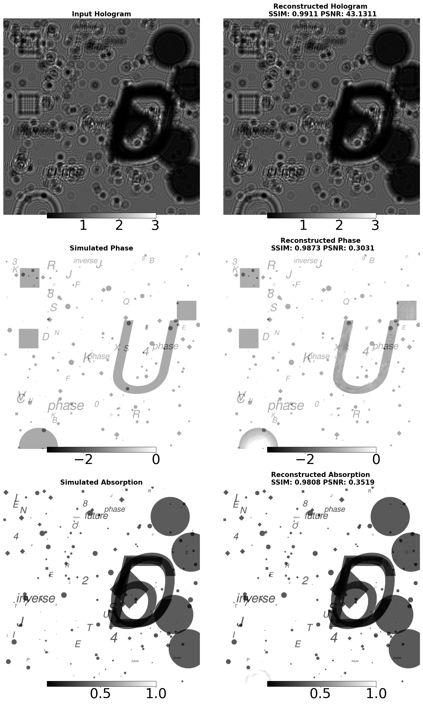
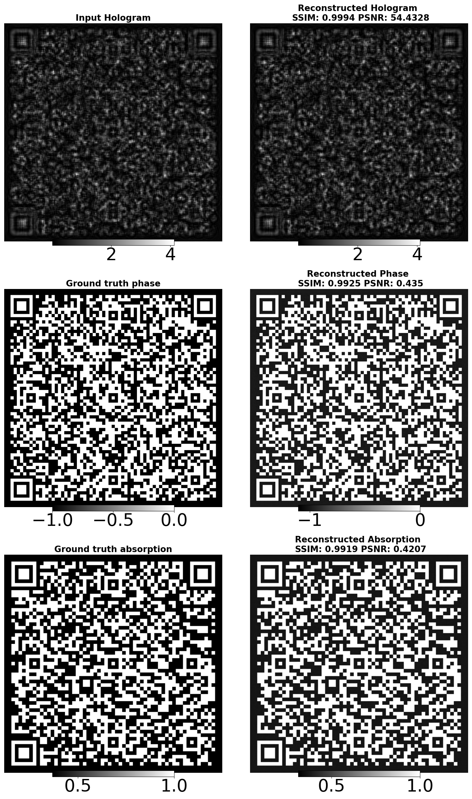

Currently creating a website to show the work that is being done in my Ph.D.

1. A short, clear summary of your research and its goals (for the overview section).
2. Descriptions for each experiment (what makes each unique, what to highlight).
3. Any additional media (GIFs, videos, diagrams) you want to include, and which experiment/result they belong to.
4. Any interactive elements you want (e.g., sliders, overlays, tooltips) and which comparisons are most important.
5. Any restrictions on sharing data or images (e.g., embargoed results, copyright).
6. (Optional) Any publications, code, or datasets to link

## Motivation

The beams of PETRA III, P05 and P07, like many other beam lines, have various inverse problems involved in them. These include computed tomography, phase retrieval, deblurring due to lenses or fly-scan rotational blurs. ForwardNET is developed with this in mind.

The phase retrieval problem is a non-linear, ill-posed inverse problem. It is also an important step in X-ray imaging, a precursor to the tomographic reconstruction stage. Experiments involving micro and nanometer-sized objects usually have weak absorption and contrast. This is usually the case in most experiments taking place at high-energy big Synchrotron centers like DESY.
Based on the works of GanRec /[1] and Deep-Image Prior /[4], this model combines different generative models, with a possibility of adding an adversarial network.

## Forwardnet

Why use neural networks though?

•Effective in learning patters and can be adapted to different inverse problems, while being roboust against Poisson and Gaussian noise,

•The model that solved a previous projection can better initialize the next projection,

•Can be easily rescaled to multiple sizes and solve multiple projection at once, depending on the size of the GPU and image

•Special thanks to the SmartPhase team of Helmholtz-Imaging for providing the data.

## Description of different experiments:

### Experiment 1: Simulation

Fig1. Letters: Propagated letter and geometric objects, which different phase and attenuation.
Fig2. QR code: Proagated QR codes having different information
Fig3. Mg-based Screw: Different noise added to the simulated object and how the model reconstructed it.

### Experiment 2: Sequential learning from a tooth data.

The phase retrieval problem has the scalability property, meaning that solving the lower resolution will be relevant to solving the higher resolution. This will help in a faster and more accurate reconstruction. This approach which learns from course to fine can help the model learn the edges and structure in lower resolution and high frequency at the higher resolution. The rgb shows how the background and edges has been well resolved in the phase.

### Experiment 3. Mg corrosion image - SMRL as a compact support

Our sequential learning (SMRL) not only benefits in learning the higher and lower frequencies, but also in resolving the background by generating compact support from the results of lower resolutions. We show here a Mg intensity data that has a not fully flat-filled corrected back ground and how Forwardnet with mask (compact support) lower resolution improves the back ground.
Fig 1: Input intensity
Fig 2: Left: SMRL with Mask, Middle: SMRL without Mask, Right: Direct reconstruction without Mask and SMRL
Fig 3: Uncertainity analysis. This helps in determining which part of the image is well reconstructed by all, but which ones the SMRL improves on.

Publications:
[Phase retrieval using GAN](https://doi.org/10.1364/opticaopen.26367208.v1)

Funded by: Helmholtz Zentrum Hereon
Logo: 

